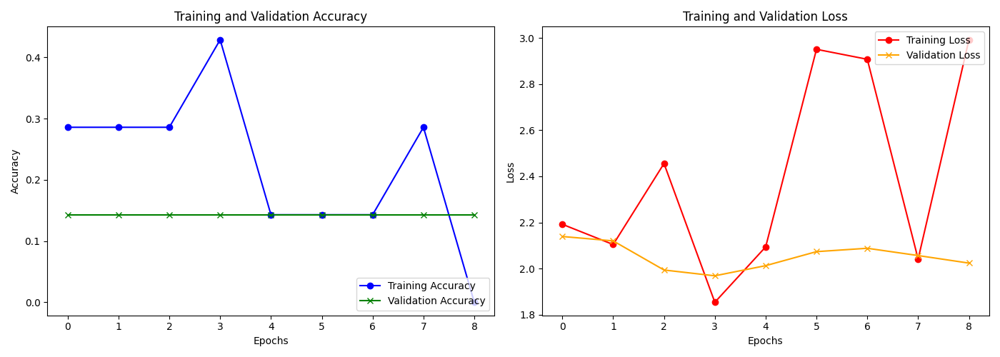

Live demo link: https://mole-identification-system-hzhplmjpwu3dvmfwyfgsve.streamlit.app/

# AI-Based Skin Disease Diagnostics System



## Overview
This system is an **End-to-End Deep Learning Architecture** designed to classify dermoscopic images of skin lesions into 7 distinct disease categories. 
Built using **Transfer Learning (MobileNetV2)** on the HAM10000 dataset, the platform prioritizes rapid inference and real-time medical explainability through **Grad-CAM**.

This project was engineered as a robust **Major Engineering/CS Project** demonstrating full-stack Machine Learning capabilities.

## Technical Architecture
- **Neural Network:** MobileNetV2 (Frozen Base) + Custom Dense/Dropout Head
- **Frameworks:** TensorFlow 2.x, Keras 3.x
- **Computer Vision:** OpenCV, PIL
- **Explainable AI:** Gradient-weighted Class Activation Mapping (Grad-CAM)
- **Frontend Dashboard:** Streamlit UI Architecture

## Explaining the Outputs (XAI)
To build trust with diagnosticians, the system doesn't operate as a "black box." It utilizes **Grad-CAM** dynamically. The AI calculates gradients of the target concept, mapping them back to the final convolutional feature maps to produce a **Heatmap** overlay on the patient image. Red areas indicate strong deep-learning activation points that led to the final prediction.

## Project Structure
```text
skin-disease-diagnosis/
│
├── dataset/                # Extracted and structured HAM10000 images divided by class
├── models/                 # Saved compiled neural networks (.h5)
│   └── model.h5
│
├── app/                    # Frontend UI & APIs
│   └── app.py              # Streamlit launch script
│
├── training/               # Model Construction
│   └── train.py            # Automated training loop with callbacks
│
├── utils/                  # Core modules
│   ├── preprocessing.py    # Rescaling, Augmentation, Directory parsing
│   ├── gradcam.py          # TF GradientTape implementation
│   └── metrics.py          # Validation processing
│
├── outputs/                # Analytical outputs 
│   └── graphs/
│
├── requirements.txt
└── README.md
```

## How to Run locally

### 1. Requirements
Ensure Python 3.9+ is installed.
```bash
pip install -r requirements.txt
```

### 2. Launch Diagnosis Dashboard
Launch the web interface instantly:
```bash
streamlit run app/app.py
```

### 3. (Optional) Retrain Network
Ensure your dataset is organized inside `dataset/`, then trigger the architecture:
```bash
python training/train.py
```

## Disclaimer
> **Medical Disclaimer:** This system is for academic and portfolio demonstration purposes ONLY. It is not FDA approved and should never replace certified clinical judgement.
